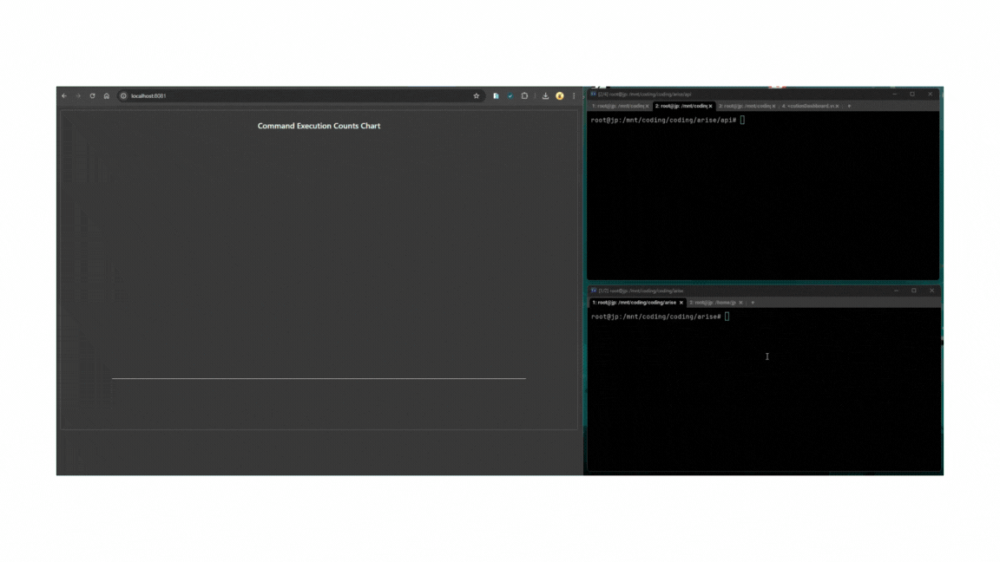
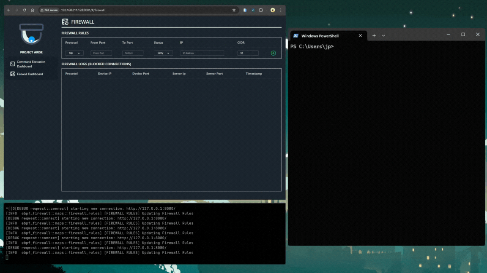

# Arise

**Arise** is a lightweight observability platform powered by **eBPF**, designed for real-time monitoring and network defense.  
It provides visibility into system events like **command execution**, **network traffic**, and **IP-based firewall activity** — all with minimal overhead.

The platform features:
- A web-based frontend built with **Vue.js**
- A backend API service built with **Actix Web** (Rust)
- **SurrealDB** for flexible, high-performance storage.

---

## Features

- 🛡️ **Command Execution Monitoring**  
  Capture and observe commands executed on the system in real-time.

  

- 🌐 **Network Traffic Monitoring (Future Feature)**  
  Track inbound and outbound network activity for greater insight into your environment.

- 🌐 **Network Traffic Mirroring (Future Feature)**  
  Duplicate traffic and then send it to another destination.

- 🚫 **IP-based Firewall**  
  Allow or Deby traffic dynamically based on IP address policies.

  

- 📊 **Web Dashboard**  
  Visualize events, network traffic, and firewall logs using an intuitive Vue.js frontend.

- ⚡ **High Performance**  
  Leveraging eBPF ensures observability with minimal performance impact.

# Video Demo
- https://youtu.be/u7v8MNT0-8Q
- https://www.youtube.com/watch?v=T8fvAxIZE3E

# Build
```
cargo build --release
```

# Launch SurrealDB
surreal start --user root --password root --bind=0.0.0.0:4050 rocksdb:arise.db

# Frontend Development
```
cd web
docker-compose up -d
docker exec -it <container_id>
yarn dev
```